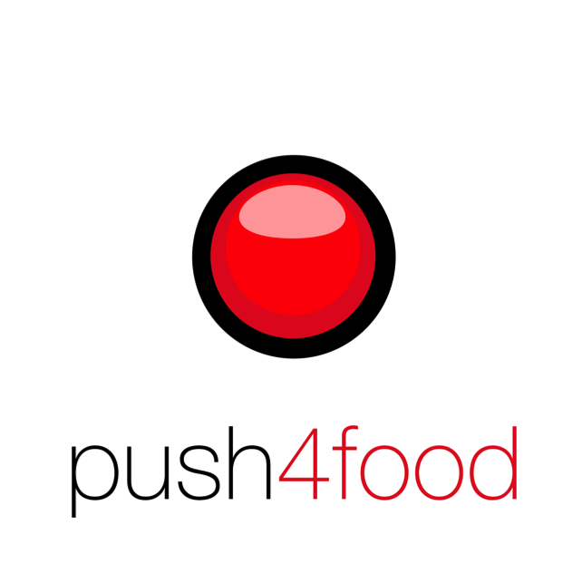
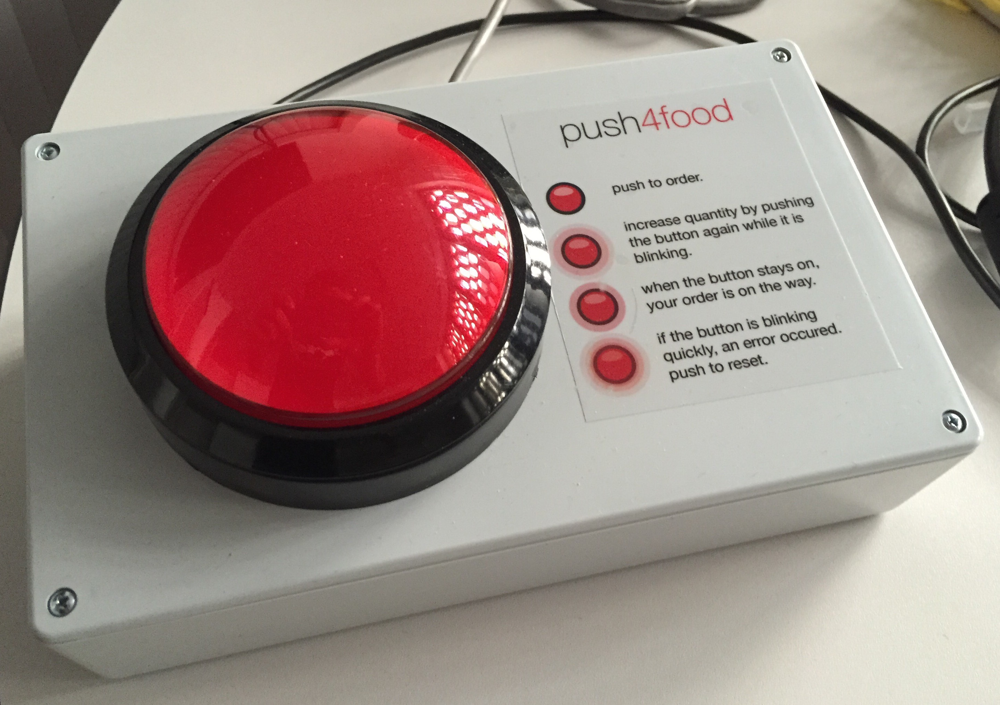
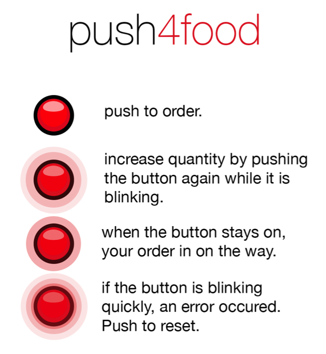

A Raspberry Pi based food ordering button

## What is that ?

push4food is a DIY project I had in mind for a while: a button to order food.

Here it is:

It works with a Raspberry Pi (B+ here, but any version should work) using Node.js and [foodcommander](https://github.com/zippy1978/foodcommander), a food ordering CLI / library I created for that purpose.

At the time it only works at Domino's Pizza in France (but feel free to extend foodcommander to add your favorite franchise !).

Usage of the button is pretty simple:

If you want to know more about it, read this post: [
push4food : a connected button to order pizza](http://www.expertisemobile.com/index.php/2015/07/23/push4food-a-connected-button-to-order-pizza/)

## Prerequisites

* a Raspberry Pi (any model)
* a push button (micro-switch) with a built-in led like this one [http://www.adafruit.com/product/1185](http://www.adafruit.com/product/1185) or this one [http://www.adafruit.com/products/1193](http://www.adafruit.com/products/1193)
* wiringPi utility command installed to configure GPIO pullupdown (install instructions [here](http://wiringpi.com/download-and-install/))
* Node.js

For Bluetooth support, install the follwing packages (on Raspbian) : 

	sudo apt-get install bluetooth bluez-utils libbluetooth-dev bluez

## Installation

	npm install push4food -g

## Usage

### Example

	push4food -v -c 30 -o order.json
	
Will start push4food in verbose mode (-v), with an order delay of 30 seconds (-c) using the *order.json* as configuraiton file (-o)

### Help

	push4food --help
	
	  Usage: push4food [options]
	
	  Options:
	
	    -h, --help                   output usage information
	    -V, --version                output the version number
	    -b, --button [button]        button GPIO port. Default is 23
	    -l, --led [led]              led GPIO port. Default is 18
	    -o, --order [order]          order file template as JSON
	    -v, --verbose                outputs debug info
	    -d, --dryrun                 dry run mode: order will not be sent
	    -c, --countdown [countdown]  countdown length in seconds. Default is 300

### Configuration file

	{
	    "franchiseId": "dominos_fr",
	    "storeId": "31664",
	    "address": {
	        "firstName": "Homer",
	        "lastName": "Simpson",
	        "email": "homer.simpson@somewhere.com",
	        "phone": "0999555555",
	        "intercom": null,
	        "building": null,
	        "floor": null,
	        "streetNumber": "74",
	        "streetName": "evergreen terrace",
	        "postalCode": "34090",
	        "city": "montpellier"
	    },
	    "dish": {
	        "id": "P4FB"
	    },
	    "variant": {
	        "options": {
	            "size": "med."
	        }
	    },    
	    "comment": "Be quick, I'm hungry"
	}
